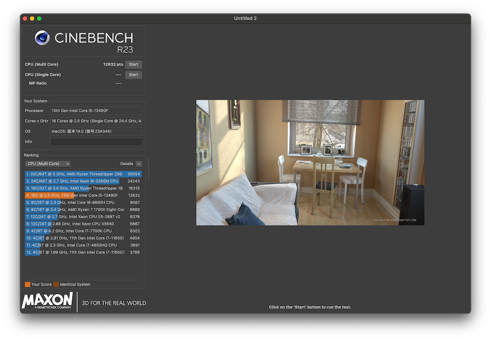

# MaxSun-B760ITX-EFI

铭瑄 B760ITX EFI

- OC 0.9.5   
- macOS 14.0 (23A344)

## 机器配置

主板：铭瑄 MS-B760ITX.  
CPU: i5-13490F.  
显卡: AMD RX6600 8G.   
内存: 64G DDR4 3200 32x2.   
硬盘: SN850X 2T, SN570 500G.   
无线网卡：AX211.   
蓝牙：同上.   

## status

| status | name                  |
| :----: | ----                  |
| ok     | CPU i5-13490F            
| ok     | GPU AMD RX6600 8G （双屏输出正常）          
| ok     | 网卡 REALTEK 8125B 2.5G 正常识别       
| ok     | 声卡 REALTEK ALC89       
| ERR    | 板载 Intel®AX211 WIFI6E 
| ok     | 同上 （正常驱动，连接蓝牙键盘正常使用）
| ok     | USB 自制（机箱前面有2个USB口）
| ok     | 睡眠正常唤醒（鼠标一碰就醒usb连接，不知道算不算正常） 
| ERR    | 隔空投送不能用，无法与Macbook快速交换文件 （-_-）重要功能缺失。有疙瘩得治

跑分时发现有些异常，分值比较低有异常。不知道啥情况，感觉哪里设置有问题。

## PS

win10升级到win11下使用wsl折腾的半死，一气之下直接转黑苹果。 

黑果折腾了2天基本可用，无线问题还待处理。
